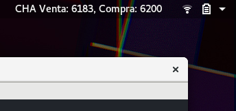

# Gnome + Chaucha

Un pequeño Widget para ver el precio de la Chaucha en tiempo real.

Por ahora funciona consultando el precio de compra y venta directamente desde el endpoint público de orionx.io:
```
https://api.orionx.io/graphql?query={marketOrderBook(marketCode:"CHACLP",limit:1){buy{limitPrice}sell{limitPrice}}}
```

Si encuentro una mejor forma de consultar, después la actualizaré.

El código se basa en el tutorial sobre extensiones de Gnome de [Samuel Masue](http://smasue.github.io/gnome-shell-tw).

Se aceptan donaciones a la billetera:
```
cicLYFa1SNbwFB66iyACJTDErZnqrJC943
```

## Instalación
Para instalar se debe clonar el proyecto en la carpeta de las Extensiones de Gnome.
```
cd ~/.local/share/gnome-shell/extensions/
git clone https://github.com/codesxt/gnome-chaucha.git gnomechaucha
```
Para activarla se requiere tener instalada la Herramienta de Retoques de Gnome / Gnome Tweak Tool.
El módulo se llama gnome-tweak-tool y en Fedora es tan simple de instalar como escribir:
```
sudo dnf install gnome-tweak-tool
```
Al ejecutar la herramienta (desde terminal como gnome-tweak-tool o desde las aplicaciones como "Retoques"),
se debe activar la extensión desde la lista de extensiones.

Si la extensión no aparece, se debe recargar Gnome reiniciando la sesión o abriendo la consola de Gnome
con Alt + F2 y escribiendo el comando 'r'.

## Resultado
La extensión cargará los datos y se actualizará cada 10 segundos.

